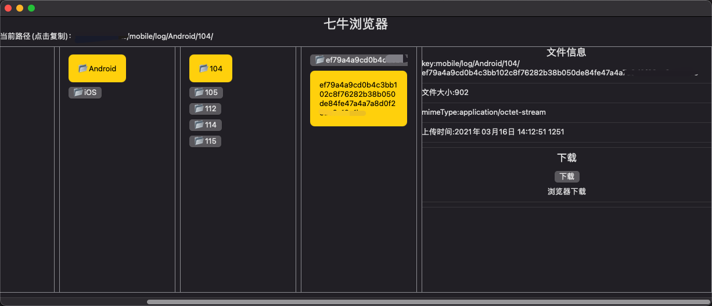

# QiniuBrowser

QiniuBrowser 用 Swift 和 Object-C 实现的 Qiniu Mac 浏览器。

实现的功能：

1. 用列表的方式查看七牛上的文件列表
1. 查看文件信息
1. 下载文件、获取文件的公开链接。

## 项目信息

1. 语言：Swift + Object-C
1. UI：SwiftUI

## 项目 UI



## 注意实现

在浏览之前需要先配置七牛的必要信息。

```swift
func setupQiniu() {
    // 七牛后台查看
    QiniuConfig.QiniuAccessKey = ""
    QiniuConfig.QiniuSecretKey = ""
    
    // 查看的 buccket
    QiniuConfig.Bucket = ""
    
    // 查看 buccket 配置的 Domain
    QiniuConfig.BucketDomain = ""
    
    // 从哪个文件夹下开始查看，可以为 "",
    // 设置时为了方便快速定位一直指定的目录
    QiniuConfig.DefaultPrefix = ""
}
```